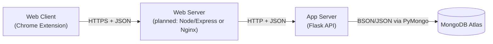
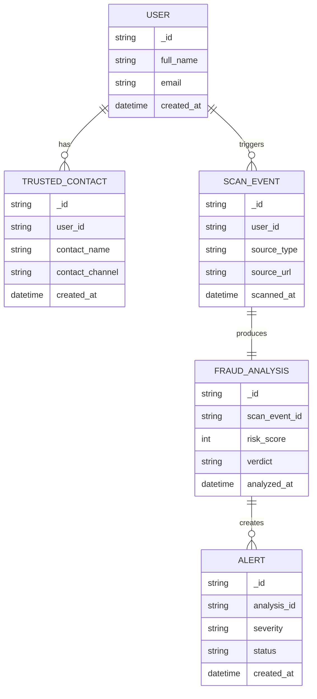

# Elder Fraud Protection Architecture

This document describes the overall architecture of the Elder Fraud Protection Application. 

## High Level Component Diagram

The Web Client is currently accessed through our Elder Fraud Protection Chrome Extension. We are also thinking of having an additional option of an Elder Fraud Protection website or desktop application. The Chrome Extension calls the Web Server, which we haven't implemented yet but likely will be Node/Express or Nginx. The Web Server then calls the App Server (Flask). The App Server then accesses our database MongoDB Atlas. 

## Relationship Diagram

The design shows each USER is the central record connected to both behavior and safety context: a user can have many TRUSTED_CONTACT entries and can trigger many SCAN_EVENT records as messages, emails, or pages are analyzed. Every scan event produces exactly one FRAUD_ANALYSIS document containing outputs such as risk score, verdict, and analysis timestamp, which makes each analysis traceable back to the original scan. From there, one analysis can generate multiple ALERT documents (for example, different severity levels or follow up states), allowing the system to track and manage warning outcomes over time. 

## Flow Diagram

